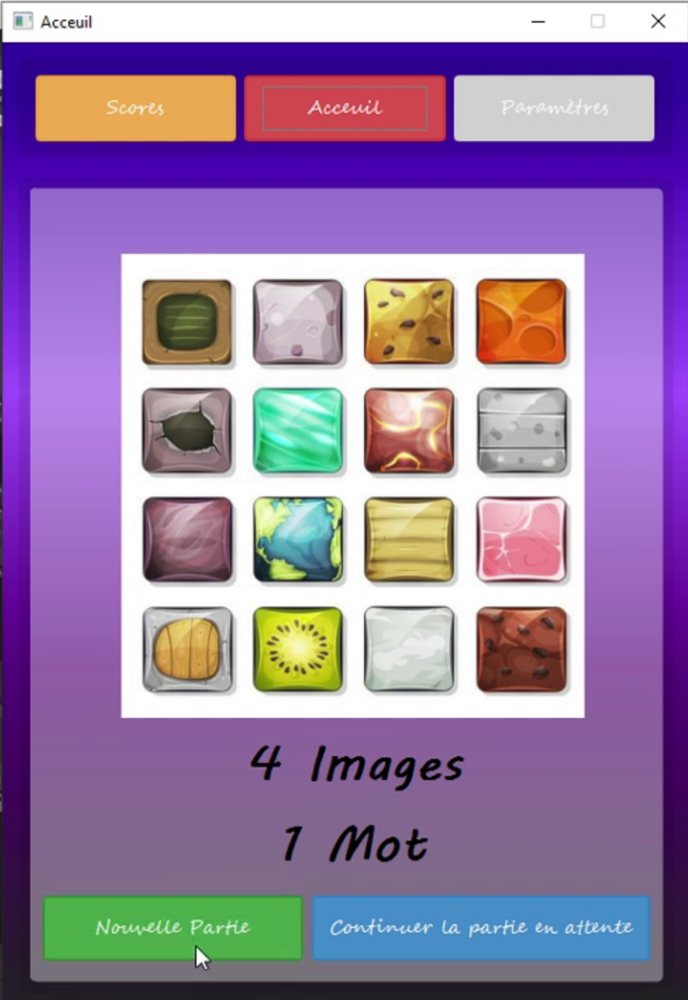
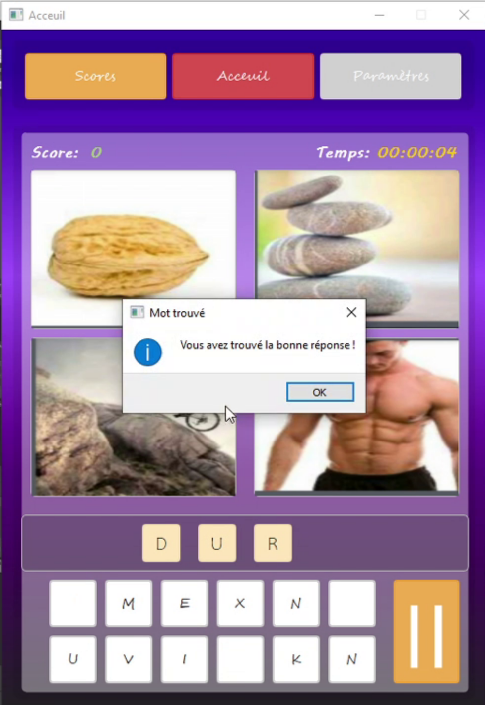

# 4 Images 1 mot

&nbsp;

Computer replica of the mobile game "4 pictures 1 word" for desktops. The game
has the possibility of adding words or removing them from the game

## Build and Run

Qt is the only requirement to build the code source and run the program since it
has been made using it.
